# Aleksei Ovchinnikov

**Software Engineer** | Frontend-focused

Building reliable web applications and embeddable feature systems

---

## ⚡ Background

Software Engineer with 2+ years of frontend experience and a strong engineering mindset shaped by 10+ years in safety-critical hydropower operations. Experienced in high-responsibility environments requiring reliability, structured incident response, and risk-aware decision-making.

---

## 🔧 Tech Stack

---

<!-- stats start -->

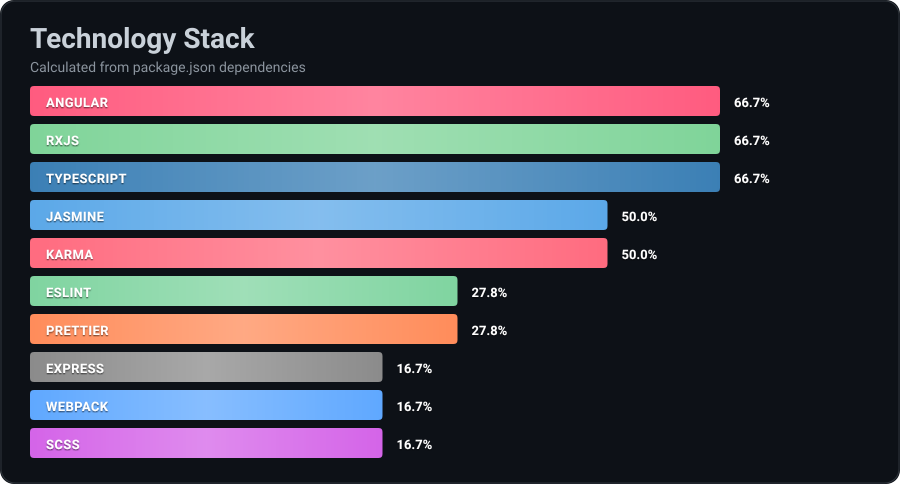
<!-- stats end -->

---

## 🚀 Educational Projects

Projects were developed in 2022-2023 independently without AI assistance during education in Rolling Scopes School. Recently published on GitHub with AI support for documentation. Current work involves closed-source enterprise applications (NDA-restricted).

<table>
   <tr>
      <td width="50%" valign="top">
         <a href="https://github.com/amgSTRIDeR/Angular_YouTube-Client"><strong>1. Angular YouTube Client</strong></a> 
         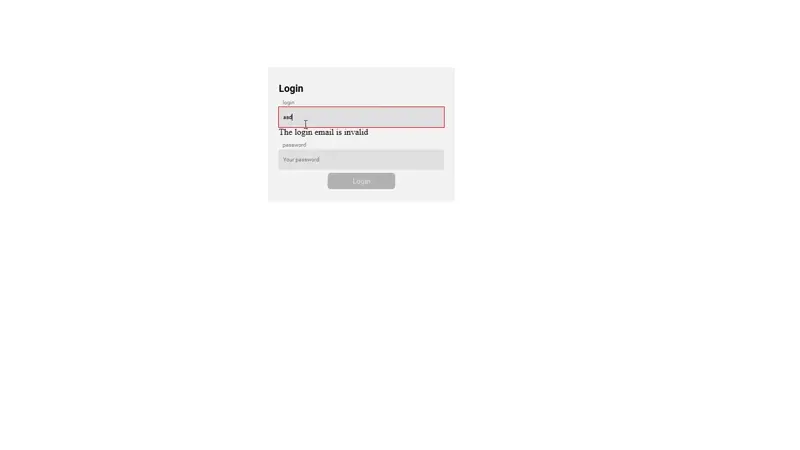 
          Educational Angular 15 YouTube client (RS School): search, sorting/filtering, detailed view, custom cards, auth guards, NgRx, Angular Material.
      </td>
      <td width="50%" valign="top">
         <a href="https://github.com/amgSTRIDeR/RS_React"><strong>2. RS React</strong></a> 
         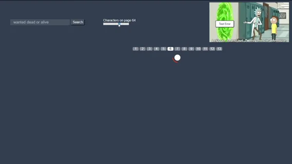 
          Educational React project - RS School course assignments and practice.
      </td>
   </tr>
   <tr>
      <td width="50%" valign="top">
         <a href="https://github.com/amgSTRIDeR/songbird"><strong>3. Songbird</strong></a> 
         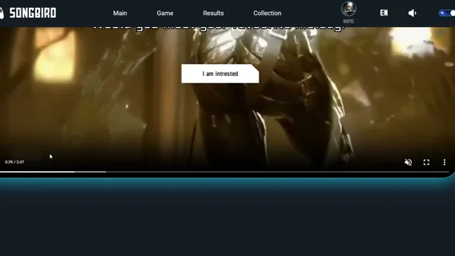 
          Songbird - Can you name that game? A musical quiz game challenging players to identify video games by their iconic soundtracks and theme songs.
      </td>
      <td width="50%" valign="top">
         <a href="https://github.com/amgSTRIDeR/shelter"><strong>4. Shelter</strong></a> 
         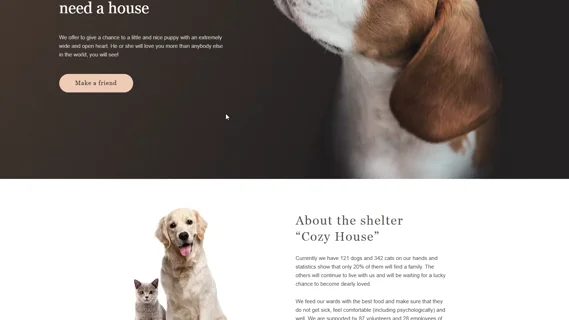 
          Educational project: responsive website for "Cozy House" animal shelter. Practice in HTML, CSS, and JavaScript layout development.
      </td>
   </tr>
   <tr>
      <td width="50%" valign="top">
         <a href="https://github.com/amgSTRIDeR/online-zoo"><strong>5. Online Zoo</strong></a> 
         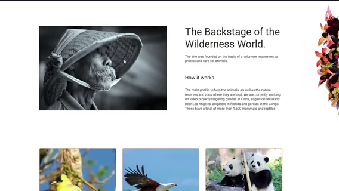 
          Educational web project featuring an online zoo platform with animal information, live stream previews, and donation system. Built with vanilla JavaScript, SCSS, and Webpack.
      </td>
      <td width="50%" valign="top">
         <a href="https://github.com/amgSTRIDeR/minesweeper"><strong>6. Minesweeper</strong></a> 
         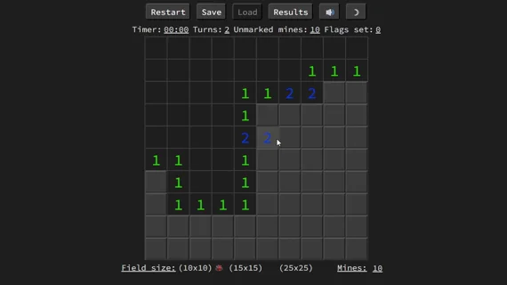 
          Classic Minesweeper game recreation with timer, flag system, and customizable grid sizes.
      </td>
   </tr>
   <tr>
      <td width="50%" valign="top">
         <a href="https://github.com/amgSTRIDeR/momentum"><strong>7. Momentum</strong></a> 
         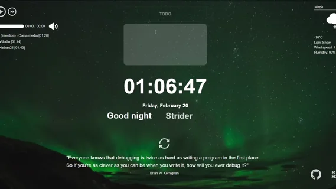 
          A feature-rich productivity dashboard with music player, todo list, weather widget, and daily quotes. Built with vanilla JavaScript.
      </td>
      <td width="50%" valign="top">
         <a href="https://github.com/amgSTRIDeR/travel"><strong>8. Travel</strong></a> 
         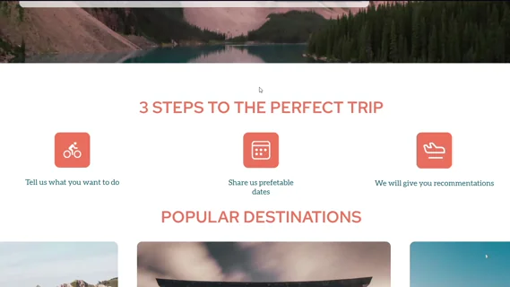 
          A small travel-themed web app built with vanilla JavaScript and SCSS.
      </td>
   </tr>
   <tr>
      <td width="50%" valign="top">
         <a href="https://github.com/amgSTRIDeR/EldritchHorror_codejam"><strong>9. Eldritch Horror Codejam</strong></a> 
         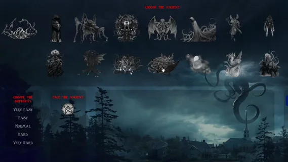 
          Deck builder and manager for the Eldritch Horror board game, created during a code jam.
      </td>
      <td width="50%" valign="top">
         <a href="https://github.com/amgSTRIDeR/Linear_Function"><strong>10. Linear Function</strong></a> 
         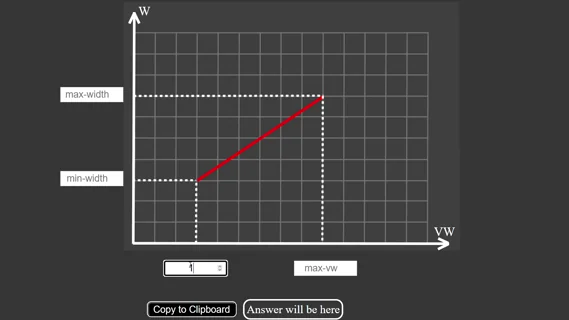 
         Web-based calculator for generating responsive CSS calc() functions using linear interpolation between viewport widths and pixel values.
      </td>
   </tr>
</table>

---

## 💡 Coding Challenges

<!-- leetcode start -->

  
<!-- leetcode end -->

---

## 🌐 Languages

-555555?style=for-the-badge&logoColor=white)

---

## 💬 Get in Touch

📧 [amgstrider@gmail.com](mailto:amgstrider@gmail.com)  
💼 [LinkedIn](https://www.linkedin.com/in/aleksei-ovchinnikov)
